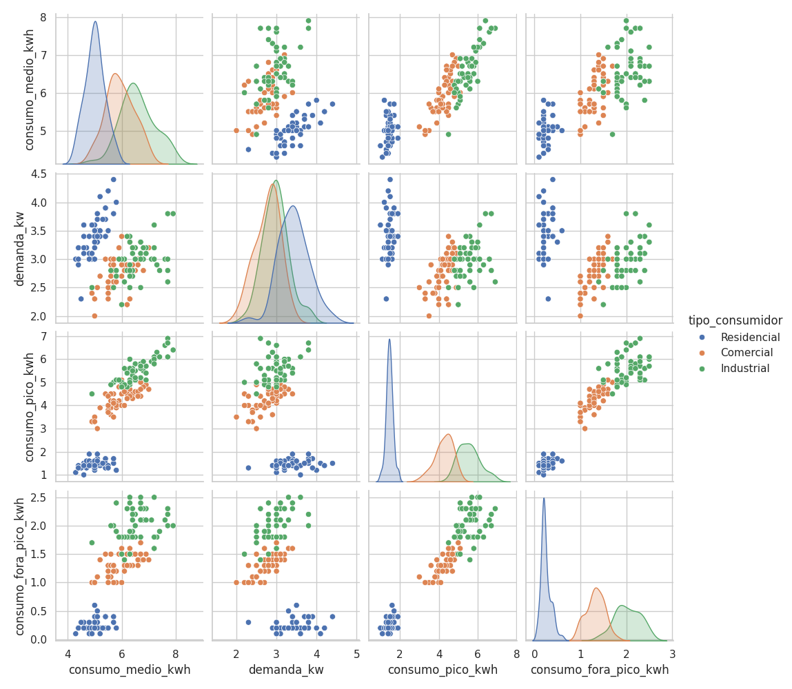
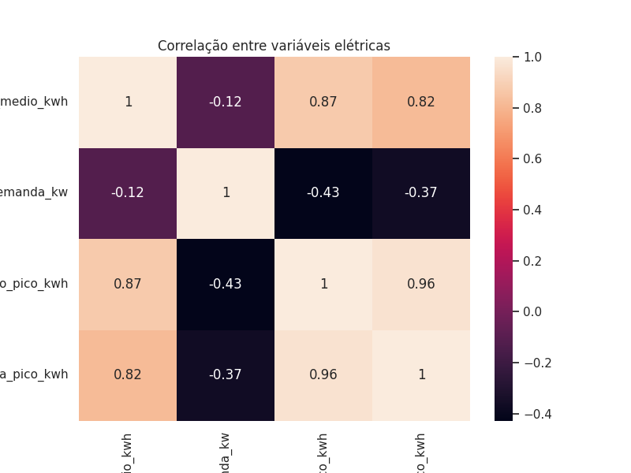
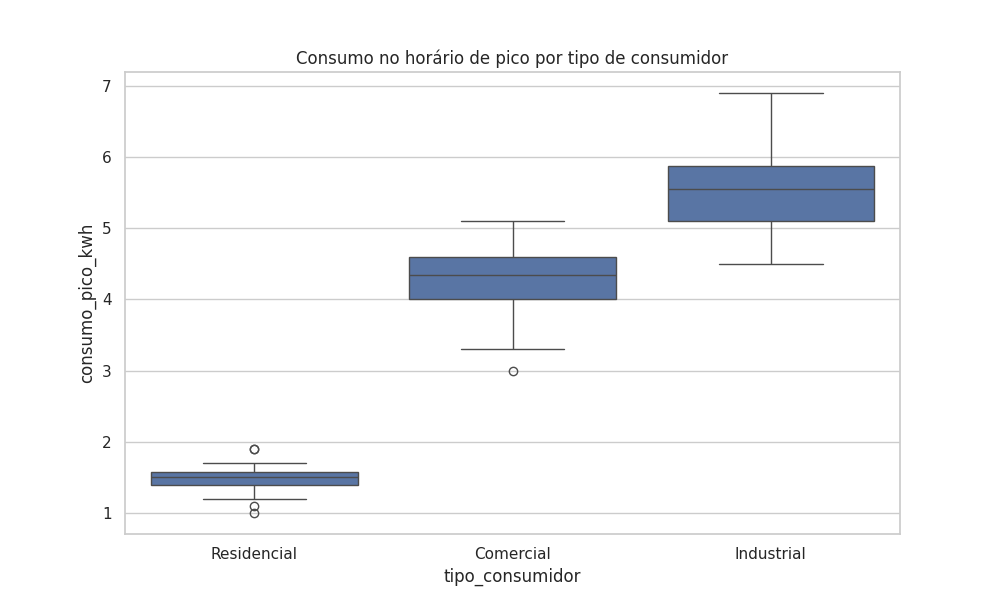

# Análise Exploratória de Consumo de Energia

## Objetivo
Analisar padrões de consumo de energia elétrica entre diferentes tipos de consumidores (residencial, comercial e industrial), identificando relações entre demanda, consumo médio e uso em horário de pico.

---

## Tecnologias utilizadas
- Python
- Pandas
- Seaborn
- Matplotlib

---

## Análises realizadas
- Distribuição de consumo por tipo de consumidor
- Correlação entre variáveis elétricas
- Comparação de consumo em horário de pico

---

## Visualizações

### 🔹 Relação entre variáveis (Pairplot)

### 🔹 Correlação entre variáveis

### 🔹 Consumo no horário de pico por tipo de consumidor

---

## Principais insights
- Consumidores industriais apresentam maior consumo médio e demanda.
- O consumo em horário de pico é mais elevado no setor comercial.
- Existe forte correlação entre consumo médio e consumo em horário de pico.
- Consumidores residenciais apresentam menor variabilidade de consumo.

---

## Observação
Os dados foram adaptados de um dataset clássico para simulação de cenários de consumo energético, com foco em análise exploratória.
